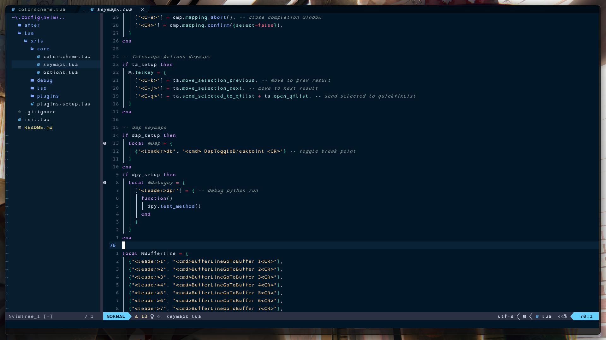

# PDE

- My Personal Development Environment (dotfiles)
- Custom child config of [NvChad](https://github.com/NvChad/NvChad)

## Showcase


## Requirements
- Install [Neovim](https://github.com/neovim/neovim/wiki/Installing-Neovim)
- (Optional) Install [Nushell](https://www.nushell.sh/book/installation.html) my personal favorite shell.
  <!-- - My [NuConfig](https://github.com/CSaintos/NuConfig) -->
- (Optional) Install [Ripgrep](https://github.com/BurntSushi/ripgrep) Telescope grep improvement.
- Install a [NerdFont](https://www.nerdfonts.com/) and set the nerdfont in your preferred terminal.
- If on Windows, Download [MinGW-Make](https://winlibs.com/#download-release)
  - Recommend downloading the UCRT runtime, latest with POSIX threads, Win64, with LLVM..., as Zip archive.
  - Extract, rename to `MinGW`, move `MinGW` to `C:/MinGW`.
  - In `C:/MinGW/bin` copy `copy mingw32-make.exe make.exe`
  - Add `C:/MinGW/bin` to system path (environment variables).
- [NPM](https://docs.npmjs.com/downloading-and-installing-node-js-and-npm) is necessary for building one of the plugins.
- If on Windows, Create a System environment variable
  - `XDG_CONFIG_HOME` = `C:/Users/<user>/.config`
- Delete old neovim folders:
```bash
# Unix Bash 
rm -rf ~/.config/nvim
rm -rf ~/.local/share/nvim

# Windows Powershell
rm ~/AppData/Local/nvim -Recurse -Force
rm ~/AppData/Local/nvim-data -Recurse -Force
```

## Install 
- `git clone https://github.com/CSaintos/PDE.git ~/.config/nvim && nvim`
<!-- - Once in nvim, navigate to line that says `use({"nvim-telescope/telescope-fzf-native.nvim",run="C:/MinGW/bin/mingw32-make.exe"}) -- telescope dependency` -->
<!--   - Change text at `run="C:/..."` to your make installation path `run="path/to/make"`  -->
<!--     - The make executable: for Unix is `make`, for windows is `mingw32-make.exe` -->
- Wait for Lazy to install plugins then type `:MasonInstallAll`.
  - Wait for Mason to install all lsps,formaters,debuggers,linters that come with NvChad by default before quiting `:q`
- If you decided to use a shell other than ✨nushell✨, then you will need to update the `options.lua` file.
  - set `sh = ` to your preferred shell
  - set `shellcmdflag = ` to your shell's command flags (or remove this option)
- Current bug with nushell and Lazy: markdown-preview will need to be installed manually due to unable to invoke shell.
  - locate markdown-preview in `nvim-data/lazy/markdown-preview/app`, and run `npm install`
- To get the vue-language-server working you may need to install the vls parser. Execute `npm install -g vls`
- To get the javascript/typescript linting engine to work. Execute `npm i -g vscode-langservers-extracted`

## Documentation
- [NvChad docs](https://nvchad.com/docs/quickstart/post-install)

## Special thanks to 
- [@siduck](https://github.com/siduck), co-authors, and contributors for making the most popular Neovim commmon-plugin boilerplate removal config [NvChad](https://github.com/NvChad/NvChad), as well as their custom ui and base46 plugins. My custom config wouldn't have been possible without you 😍.
